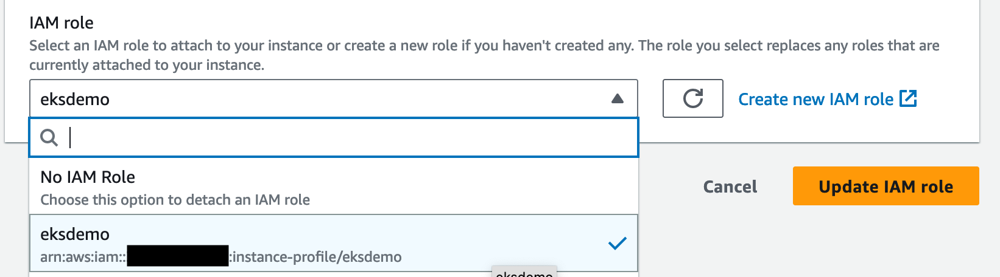

# EKS Demonstration with pipeline

This demo will allow you to use cloud9 to launch an EKS cluster and create a pipeline with appropriate permissions so that local code can be pushed to CodeCommit, the pipeline builds the image and then deploys to EKS. 
A change to the code can then be pushed resulting in a change to the deployment which is rolled out without any downtime. 

This demo was presented at AWS London Summit in 2022 as a way to showcase how containers can help customers reduce operational burden whilst benefitting from the advantages containerised workloads offer. I've automated the setup as much as possible but there are still some steps required to launch and then run through the demo. 

Make sure you are using the demo in a region that supports Fargate on EKS. This has been successfully demonstrated in us-east-1, us-east-2, eu-west-1, eu-west-2 & eu-west-3 regions. 

## Instructions

Launch a cloud9 desktop.

Once launched, create an EC2 role using this [deep link](https://console.aws.amazon.com/iam/home#/roles$new?step=review&commonUseCase=EC2%2BEC2&selectedUseCase=EC2&policies=arn:aws:iam::aws:policy%2FAdministratorAccess&roleName=eksdemo) 

If the deep link doesn't work, go to IAM and create a role for EC2 with AdministratorAccess policy attached. 

Once the role has been created, use the EC2 console to attach the role to the instance running the Cloud9 environment.

From Cloud9 at the top right, click on the circle with the initial, then Manage EC2 instance. 


The EC2 console should load where you need to assign the newly created role


From the list of roles, choose the eks-demo role and click Update IAN Role




Run the following command in the Cloud9 shell to turn off managed credentials


```
aws cloud9 update-environment  --environment-id $C9_PID --managed-credentials-action DISABLE
rm -vf ${HOME}/.aws/credentials

```

Validate that you are using the correct role with the following command

```aws sts get-caller-identity```

It should return a role that includes eksdemo in the name 

Clone the repository from WHEREVER WE DECIDE TO STORE

change to the `eks-demo/setup` directory

Run the `setup.sh` script which will launch the cluster and create the pipeline as well as roles etc. 

Setup creates all the resources required to launch an EKS cluster as well as create a pipeline to use to update the workload. It also resets the git configuration so the eks-demo directory can be pushed to CodeCommit and the pipeline triggered to update. 

Once setup is finished, run the following to get the load balancer address and validate that the frontend service is working.

```
kubectl get svc -n fargate
```

Copy the address in the EXTERNAL-IP column and load it into a browser. You should see a static image with "Welcome to London" at the bottom.

The premise of the demo is to showcase how EKS in conjunction with Codepipeline means that developers can push their code and the configurations will allow for the new code to be deployed whilst not taking the existing instances down until the new ones are ready to assume service. 

To showcase this, the following snippet from `frontend.yml` gives more information:

```
---
apiVersion: apps/v1
kind: Deployment
metadata:
  name: frontend
spec:
  replicas: 3
  strategy:
    type: RollingUpdate
    rollingUpdate:
      maxUnavailable: 2
      maxSurge: 2
  selector:
    matchLabels:
      app: frontend
```

The `replicas=3` declaration shows we want 3 copies at all times and EKS will maintain this desired state however when we update the deployment, we can tolerate 1 being unavailable at most therefore when the new version is deployed, EKS will take down one copy whilst it launches two of the new version then when both of those are available, it'll replace the remaining old one with a new deployment. 

Run the following command to change the frontend to the new version:

```
cd ~/environment/eks-demo
rm -rf frontend
cp -r frontend-dynamic frontend
git add .
git commit -m "Switched to new frontend"
git push origin main 
```

The push to CodeCommit will trigger the pipeline where the new image will be built then deployed to EKS. 

To watch this happening from the CLI, run the following command: 

```
while true; do kubectl get pods -n fargate; echo; sleep 1; done
```

Note: kubectl does have a function to watch resources however it can be confusing trying to track whats going on so the above command groups things better to see how things are progressing. 

Once rolled out, refresh the browser tab and you should see a new page with a video now. 

You can look at the CodePipeline console to see the steps that were followed and you can look at the details of the CodeBuild step to see what went on including the image build and then the call to EKS to update the deployment. 

Once you're done with the demo, run the `cleanup.sh` script in the `setup` folder 

Note regarding image and video included in Demo. These belong to Darren Paxton and these are free to be used with this demo with no expectation of royalty, credit or otherwise. 